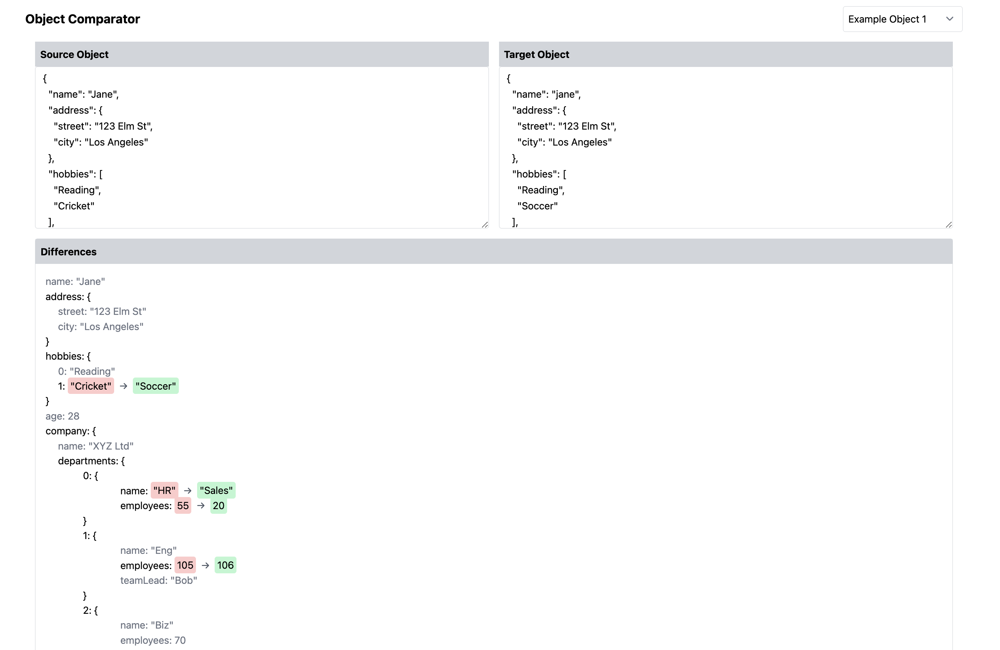

This project does a deep comparison of 2 objects/array and returns the difference between the 2 objects.



- The red div displays the value that got deleted / updated 
- The green fiv displays the value that got added / updated

### Features
- Compare two objects and identify values that were added, updated, deleted, or unchanged.
- Ability to ignore specific properties using regex patterns.
- Option to ignore array sequence changes, treating arrays as sets.
- Option to test arrays with a key instead of index ( defaults to index )
- Option to check against case insensitivity
- Visual representation of the differences using a React component.


## Components:

- ObjectEditor: simple textarea to write objects
- DiffViewer: to view changes in the objects
- utils: main utils which contains the magic sauce to calculate object diff


## Options


#### `deepDiffMapper.map(obj1, obj2, options)`

| Parameter | Type     | Default | Description                               |
| --------- | -------- | ------- | ----------------------------------------- |
| `obj1`    | `object` | -       | The first object to compare.              |
| `obj2`    | `object` | -       | The second object to compare.             |
| `options` | `object` | `{}`    | Configuration options. See details below. |

#### Options:

| Option | Type | Default | Description |
| --- | --- | --- | --- |
| `caseInsensitive` | `boolean` | `false` | If set to `true`, string comparisons will be case-insensitive. |
| `keyForArrayCheck` | `string` | `null` | When comparing arrays of objects, specify a key to match objects (like an ID). |
| `ignoreList` | `array` | `[]` | An array of regex patterns. If a key matches any pattern, changes to that key will be treated as unchanged. |
| `ignoreArraySequence` | `boolean` | `false` | If set to `true`, the order of arrays will not affect the comparison. |

**Example:**

```javascript
const diff = deepDiffMapper.map(obj1, obj2, {
  caseInsensitive: true,
  keyForArrayCheck: 'id',
  ignoreList: [/company\.departments\.teamLead/, /age/],
  ignoreArraySequence: true
})
```

---

This format clearly represents the available options and their descriptions for the user to reference.


# vite React TypeScript tailwindcss starter

Template for vite, React + tailwindcss + TypeScript projects with some tools preconfigured.

## About

Template for vite, React + tailwindcss + TypeScript projects with some tools preconfigured.


### Libraries

- [React 18](https://reactjs.org/)
- [React Router 6](https://reactrouter.com)
- [tailwindcss 3](https://tailwindcss.com/)
  - [tailwindcss forms plugin](https://tailwindcss-forms.vercel.app/)
- [TypeScript 4.9.5](https://www.typescriptlang.org/)
- [vite 4](https://vitejs.dev/)
- [vitetest](https://vitest.dev/)

### Tools

- [commitlint 17](https://commitlint.js.org)
- [Conventional Commits 1](https://www.conventionalcommits.org)
- [editorconfig](https://editorconfig.org/)
- [eslint 8](https://eslint.org/)
- [husky 8](https://typicode.github.io/husky/#/)
- [Prettier 2](https://prettier.io/)
- [VS Code settings](https://code.visualstudio.com/)


```bash
yarn
yarn dev
yarn test
```
